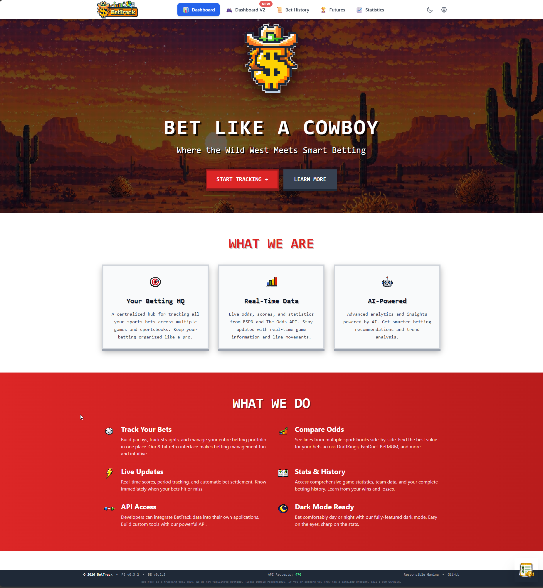
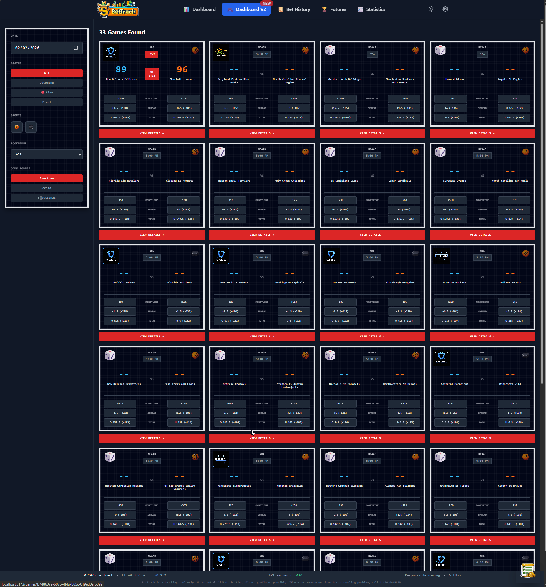
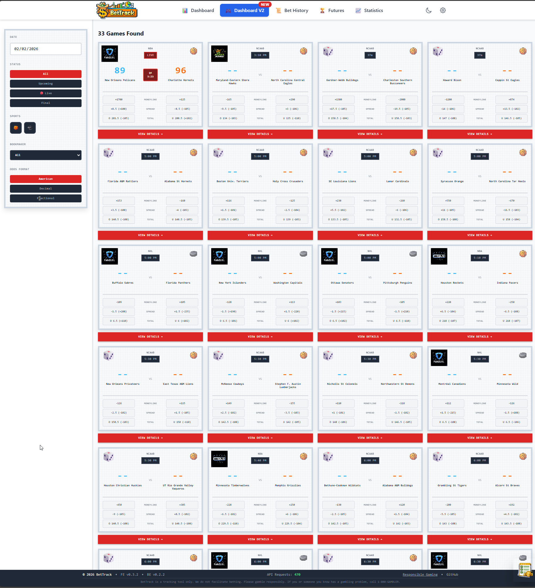

  

# BetTrack Sports Betting Platform

**A comprehensive sports betting tracking system powered by Model Context Protocol (MCP)**

## Overview

BetTrack is a dual-platform sports betting analytics and tracking solution that combines real-time sports data with intelligent bet management. The system consists of two integrated components:

**🤖 MCP Server** - A Model Context Protocol server that provides Claude Desktop with direct access to live sports odds, scores, schedules, and team data through natural language queries. Query betting lines, track games, and analyze matchups conversationally through Claude.

**📊 Dashboard** - A full-featured web application for tracking bets, analyzing odds history, visualizing line movements, and managing futures betting across 7+ major sports. Built with React, Node.js, and PostgreSQL for professional-grade bet tracking and analytics.

Whether you're using Claude Desktop to research bets with natural language or the web dashboard to track your betting portfolio, BetTrack provides the data and tools you need.

## Screenshots

### Dashboard Home Page

*Landing page with feature overview and quick start guide*

### Dashboard V2 - Dark Mode

*Retro 8-bit styled dashboard with pixel-perfect game cards, inspired by classic 80s/90s sports games like Retro Bowl*

### Dashboard V2 - Light Mode

*Nostalgic arcade aesthetic with chunky borders, monospace fonts, and vintage scoreboard layouts*

## Key Features

### MCP Server

- **30+ sports data tools** for Claude Desktop integration
- **Live betting odds** from The Odds API (multiple bookmakers)
- **Comprehensive ESPN data** (scores, standings, schedules, rosters, news)
- **Natural language search** for teams, matchups, and odds
- **70+ betting markets** including game lines and player props (NFL, NBA, NHL, MLB)
- **Visual scoreboards** with interactive React artifacts
- **Team logo URLs** and formatted markdown tables

### Dashboard

- **Retro 8-bit interface** inspired by classic 80s/90s sports games (Retro Bowl, Tecmo Bowl)
- **Pixel-perfect game cards** with nostalgic scoreboard styling and chunky borders
- **Futures betting** with 11 outright sports (Super Bowl, NBA Championship, etc.)
- **Bet tracking** with parlays, teasers, and futures support
- **Odds history** and line movement visualization
- **Automated odds sync** with background jobs
- **Outcome resolution** for automatic bet settlement
- **Dark/Light mode** with retro color schemes (cyan/orange scores, red LIVE indicators)
- **Timezone-aware** game filtering and scheduling
- **PostgreSQL database** with Prisma ORM

**📚 Learn More**: See [docs/ANALYTICS-IMPLEMENTATION-SUMMARY.md](docs/ANALYTICS-IMPLEMENTATION-SUMMARY.md) for complete planning details and [.github/ISSUE_TEMPLATE/](.github/ISSUE_TEMPLATE/) for feature specifications.

## Getting Started

### MCP Server Installation

For Claude Desktop integration with sports data tools:

👉 **[Complete MCP Server Setup Guide](mcp/README.md)**

Quick install: Download the latest `.mcpb` package from [Releases](https://github.com/WFord26/BetTrack/releases) and install via Claude Desktop settings.

### Dashboard Installation

For the web-based bet tracking and analytics platform:

👉 **[Complete Dashboard Setup Guide](dashboard/README.md)**

Quick start: Requires Node.js 20+, PostgreSQL, and an Odds API key. Docker Compose configurations available for production deployment.

## Documentation

### MCP Server Documentation

- **[Installation & Configuration](mcp/README.md)** - Complete setup guide for Claude Desktop
- **[Available Tools](docs/AVAILABLE-TOOLS.md)** - All 30+ MCP tools and 70+ betting markets
- **[Build Instructions](scripts/README.md)** - Building MCPB packages from source

### Dashboard Documentation

- **[Dashboard Setup](dashboard/README.md)** - Web application installation and deployment
- **[Deployment Guide](dashboard/DEPLOYMENT.md)** - Production deployment with Docker & Nginx
- **[Testing Guide](dashboard/TESTING.md)** - Running backend and frontend tests

### General Documentation

- **[Release Process](docs/RELEASE-PROCESS.md)** - Version management and release workflow
- **[CI/CD & Testing](docs/CI-CD-TESTING.md)** - Automated testing and deployment
- **[Build Quick Reference](scripts/QUICK_REFERENCE.md)** - Common build commands

## Supported Sports

**7+ Major Sports:**

- 🏈 **NFL** - American Football (Pro)
- 🏀 **NBA** - Basketball (Pro)
- 🏀 **NCAAB** - College Basketball (Men's & Women's)
- 🏒 **NHL** - Hockey (Pro)
- ⚾ **MLB** - Baseball (Pro)
- ⚽ **EPL** - English Premier League
- ⚽ **UEFA** - Champions League
- 🏈 **College Football**
- And many more via The Odds API...

## Technology Stack

### MCP Server Components

- **FastMCP** - Model Context Protocol framework
- **Python 3.11+** - Async/await API handlers
- **The Odds API** - Live betting odds (500+ markets)
- **ESPN API** - Sports data and statistics

### Dashboard Components

- **Frontend:** React 18, Vite, Redux Toolkit, Tailwind CSS with custom 8-bit pixel styling
- **Design:** Retro 8-bit aesthetic with monospace fonts, pixel grid overlays, and arcade-inspired UI
- **Backend:** Node.js 20, Express, TypeScript, Prisma ORM
- **Database:** PostgreSQL 16
- **Deployment:** Docker, Nginx, Let's Encrypt SSL

## Support

- **Issues:** [GitHub Issues](https://github.com/WFord26/BetTrack/issues)
- **Discussions:** [GitHub Discussions](https://github.com/WFord26/BetTrack/discussions)
- **Documentation:** Project Wiki (coming soon)

---

**Built with ❤️ for Claude Desktop and the sports betting community**

[MCP Server Setup](mcp/README.md) · [Dashboard Guide](dashboard/README.md) · [Documentation](docs/) · [Releases](https://github.com/WFord26/BetTrack/releases)

